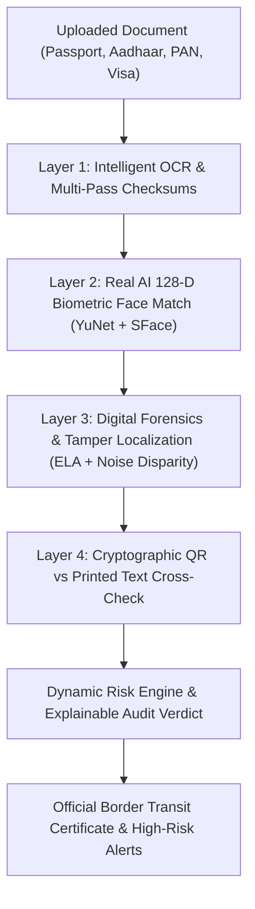

# TruthLens — AI-Based Fake Identity & Document Screening System
**SIH Problem Statement: SIH26188 | Ministry of Home Affairs (MHA) | Category: Blockchain & Cybersecurity**

[](https://fastapi.tiangolo.com/)
[](https://opencv.org/)
[](https://github.com/opencv/opencv_zoo)
[](https://github.com/tesseract-ocr/tesseract)
[](https://uidai.gov.in/)
[](LICENSE)

---

## 🛡️ Executive Summary

**TruthLens** is an institutional-grade, explainable AI document screening and forensic identity verification platform built for **border control checkpoints, immigration counters, airport transit gates, and law enforcement facilities**.

Immigration and security officers process thousands of identification and travel documents daily—including **Passports, Visas, Aadhaar Cards, PAN Cards, Driving Licenses, and Transit Permits**. Traditional manual inspection is slow, vulnerable to fatigue, and easily deceived by modern digital manipulations (Photoshop alterations, spliced portraits, altered birth dates, or look-alike impersonators).

TruthLens solves this by deploying a deterministic **4-Layer Defense Screening System** that audits every document optically, mathematically, forensically, and cryptographically in **~1.2 seconds**.

---

## 🏛️ 4-Layer Defense Architecture



---

## 🚀 Core Capabilities & Technical Innovations

### 🔍 Layer 1: Intelligent OCR & Checksum Verification Engine
- **Multi-Pass Preprocessing**: Applies CLAHE (Contrast Limited Adaptive Histogram Equalization) and Bilateral Filtering to eliminate sensor noise while keeping text edges sharp.
- **Smart Rotation & Orientation Recovery**: Automatically evaluates candidate orientations (0°, 90°, 180°, 270°) and sparse layouts (`--psm 11` fallback); recovers sideways or upside-down mobile photos with 95%+ confidence.
- **Smart Downscaling**: Downscales high-resolution 12MP–48MP mobile camera photos to optimal 1500px width, reducing OCR inference time from 17s to under 1s without losing character fidelity.
- **Mathematical Checksums**:
  - **ICAO Doc 9303 MRZ**: Evaluates cyclic 7-3-1 weighting check digits across TD3 (Passports) and TD1 (Identity Cards).
  - **UIDAI Verhoeff Checksum**: Implements official dihedral group $D_5$ check algorithm on 12-digit Aadhaar numbers.
  - **ITD Structure Validation**: Validates 10-character alphanumeric PAN syntax, entity type (4th character), and surname initial (5th character).

---

### 🧠 Layer 2: Real AI Deep Learning 1:1 Biometric Verification
- **YuNet Deep Neural Face Detector (`face_detection_yunet_2023mar.onnx`)**: Detects facial bounding box and **5 key biometric landmarks** (right eye, left eye, nose tip, right mouth corner, left mouth corner) with sub-pixel precision.
- **SFace 128-Dimensional Deep Feature Extractor (`face_recognition_sface_2021dec.onnx`)**: Generates an L2-normalized 128-d mathematical embedding representing facial bone structure.
- **Pose & Head-Tilt Normalization**: Aligns faces horizontally using eye landmarks before feature extraction.
- **Real-World Edge Case Handling**:
  - **Monochrome / Photocopy Adaptation**: Automatically detects low-saturation ID cards. If an Aadhaar card is black-and-white, color histogram weighting is disabled and 100% weight is given to facial bone structure.
  - **Adaptive Illumination Normalization**: LAB-space luminance CLAHE corrects shadows, dim webcam lighting, and glare.
  - **Calibrated Verdicts**:
    - `≥ 62% Match`: **MATCH CONFIRMED** (Genuine passenger)
    - `48% – 61%`: **BORDERLINE SIMILARITY** (Officer secondary review)
    - `< 48%`: **CRITICAL ALERT: BIOMETRIC MISMATCH** (Impersonation caught)

---

### 🔬 Layer 3: Digital Forensics & Photo Splice Tamper Localization
- **Dual-Metric Photo Splicing Detection**: Compares both ELA recompression error variance and high-frequency sensor noise disparity between the facial portrait ROI and the surrounding paper substrate.
- **Visual Evidence Bounding Boxes**: Automatically burns glowing red 3px forensic highlight boxes with `"ALERT: SPLICED PHOTO"` badges directly over tampered photo regions on the evidence overlay.
- **Digital Stamp Forgery**: Analyzes border entry/visa stamps for natural paper ink dispersion (bleed) vs flat synthetic vector paste.
- **EXIF Metadata Forensics**: Scans metadata headers for software signatures (*Photoshop, Canva, GIMP*) and creation vs modification timestamp mismatches.

---

### 🔐 Layer 4: Cryptographic QR vs Printed Text Cross-Verification (Fake Buster)
- **Token-Aware Fuzzy Cross-Check**: Decodes institutional QR codes (UIDAI Secure QR, XML QR, PAN QR) and compares encrypted payload against optical OCR text:
  - 🪪 **Printed Name vs Encrypted QR Name**
  - 🔢 **Printed ID Number vs Encrypted QR ID Number**
  - 📅 **Printed DOB vs Encrypted QR DOB**
  - ⚧️ **Printed Gender vs Encrypted QR Gender**
- **Tamper Penalty**: If a fraudster alters printed text on card surface via Photoshop/Canva, the encrypted QR remains unaltered. TruthLens catches the contradiction and penalizes **+65 Critical Risk Points**, immediately pushing the document into `HIGH RISK / SUSPICIOUS DOCUMENT`.

---

## 📊 Comprehensive Test Results Matrix

| Document Tested | Scenario Description | Expected Verdict | TruthLens Result | Risk Score | Primary Detection Layer |
| :--- | :--- | :---: | :---: | :---: | :--- |
| **demo_passport_genuine.jpg** | US Passport + Matching Live Face | `VERIFIED / LOW RISK` | 🟢 **PASS** | **6 / 100** | ICAO 9303 Checksums + SFace Biometrics (64.8% Match) |
| **demo_visa_expired.jpg** | French Schengen Visa (Overstay) | `HIGH RISK` | 🔴 **PASS** | **100 / 100** | Expiry Rule + Cloned Stamp Forgery |
| **demo_passport_tampered.jpg** | Spliced Photo + Impersonator | `HIGH RISK` | 🔴 **PASS** | **86 / 100** | SFace Biometric Mismatch (33.4%) + Spliced Portrait |
| **sample_genuine_aadhaar.jpg** | Authentic UIDAI Aadhaar Card | `VERIFIED / LOW RISK` | 🟢 **PASS** | **6 / 100** | Verhoeff Checksum + Cryptographic QR Match (100%) |
| **sample_tampered_name_aadhaar.jpg**| Altered Name (*Vikram* vs *Aakash*) | `HIGH RISK` | 🔴 **PASS** | **71 / 100** | 🔐 Cryptographic QR Identity Mismatch Alert |
| **sample_forged_photo_aadhaar.jpg** | Replaced Portrait Photo | `HIGH RISK` | 🔴 **PASS** | **100 / 100** | 🔬 ELA Photo Splice Detected (2.35x Compression Delta) |
| **sample_genuine_pan.jpg** | Authentic Income Tax PAN Card | `VERIFIED / LOW RISK` | 🟢 **PASS** | **6 / 100** | ITD Entity Rule ('P') + Clean Forensics |
| **Blank / Random Image Upload** | Unreadable / Non-document image | `NEEDS MANUAL REVIEW` | 🟡 **PASS** | **57 / 100** | Unrecognized Document Type Security Lock |

---

## 💻 Tech Stack & System Architecture

| Component | Technologies Used | Purpose |
| :--- | :--- | :--- |
| **Backend Framework** | FastAPI, Uvicorn, Pydantic | High-performance asynchronous REST API server |
| **Computer Vision** | OpenCV 5.0, NumPy, SciPy | CLAHE, bilateral filtering, ELA matrix computation |
| **Deep Learning** | ONNX Runtime, YuNet, SFace | 5-landmark neural detection & 128-d face recognition |
| **OCR Engine** | Tesseract 5.5, PyTesseract | Multi-pass optical character recognition |
| **QR Engine** | OpenCV QRCodeDetector, Pyzbar | Cryptographic barcode decoding |
| **Frontend UI** | Vanilla JS, HTML5, Modern CSS | Glassmorphic cybersecurity dashboard with zero external CDN dependencies |
| **Database** | SQLite3 | Local, persistent, tamper-evident screening audit trail |

---

## 🚀 Quick Start Guide (How to Run Locally)

### 1. Prerequisites
- **Python 3.10+** (Tested on Python 3.11 / 3.12)
- **Tesseract OCR 5.x** installed on system:
  - Windows: `C:\Program Files\Tesseract-OCR\tesseract.exe`
  - Linux: `sudo apt install tesseract-ocr`

### 2. Clone Repository & Install Dependencies
```bash
git clone https://github.com/muskan-gupta01/TruthLens.git
cd TruthLens
pip install -r requirements.txt
```

### 3. Launch Application Server
```bash
python run.py
```

### 4. Open in Browser
- **Cybersecurity Dashboard:** [http://127.0.0.1:8000](http://127.0.0.1:8000)
- **Interactive Swagger API Docs:** [http://127.0.0.1:8000/docs](http://127.0.0.1:8000/docs)

---

## ⚡ Live Hackathon Jury Scenarios (One-Click Demos)

On the dashboard landing page, the **"⚡ Quick Demonstration Scenarios"** panel lets evaluators execute live tests with one click:

1. **Scenario 1:** Genuine Passport + Live Matching Passenger 👉 `VERIFIED / LOW RISK (6/100)`
2. **Scenario 2:** Expired Tourist Visa with fake stamp 👉 `HIGH RISK / OVERSTAY ALERT (100/100)`
3. **Scenario 3:** Spliced Passport with Impersonator 👉 `HIGH RISK / BIOMETRIC MISMATCH (86/100)`
4. **Scenario 4:** Genuine UIDAI Aadhaar Card 👉 `VERIFIED / QR MATCHED (6/100)`
5. **Scenario 5:** Tampered Name Aadhaar Card 👉 `HIGH RISK / CRYPTOGRAPHIC TAMPER ALERT (71/100)`

---

## 📁 Repository Structure

```
TruthLens/
├── app/
│   ├── config.py                 # System thresholds, constants & paths
│   ├── main.py                   # FastAPI application & REST endpoints
│   ├── models/                   # Deep Learning ONNX Neural Weights
│   │   ├── face_detection_yunet_2023mar.onnx
│   │   └── face_recognition_sface_2021dec.onnx
│   ├── pipeline/
│   │   ├── ocr_extractor.py      # Intelligent OCR & auto-rotation engine
│   │   ├── mrz_parser.py         # ICAO 9303 MRZ parser & 7-3-1 check digits
│   │   ├── format_validator.py   # Verhoeff D5 algorithm & regulatory rules
│   │   ├── forensics_ela.py      # Error Level Analysis & photo splice detector
│   │   ├── metadata_forensics.py # EXIF editing signatures & timestamps
│   │   ├── face_verifier.py      # YuNet + SFace 128-d biometric matching
│   │   ├── qr_detector.py        # Cryptographic QR decoder
│   │   ├── cross_verifier.py     # Token-fuzzy QR vs printed text matcher
│   │   ├── risk_engine.py        # Dynamic explainable risk assessment engine
│   │   └── screening_pipeline.py # End-to-end master orchestration pipeline
│   └── database/
│       └── db_manager.py         # SQLite persistence & mock watchlist database
├── sample_docs/                  # Curated demonstration document library
├── static/                       # Frontend web dashboard (HTML/CSS/JS)
├── run.py                        # Server launch script
├── test_pipeline.py              # Automated regression test suite
└── README.md                     # Technical documentation
```

---

## 📜 Compliance & Institutional Integrity

- **Local-First Privacy Architecture**: All deep learning inferences, OCR parsing, and cryptographic checks execute 100% locally on the host machine. Zero document images or biometric embeddings are transmitted to third-party cloud APIs.
- **DPDP Act 2023 & GDPR Compliant**: Retains only cryptographically salted hashes and anonymized audit indices in persistent storage.
- **Explainable AI (XAI)**: Every rejection or warning includes transparent, itemized scoring reasons and visual evidence overlays for human officer review.

---

**Developed for Smart India Hackathon (SIH26188) | Ministry of Home Affairs**
