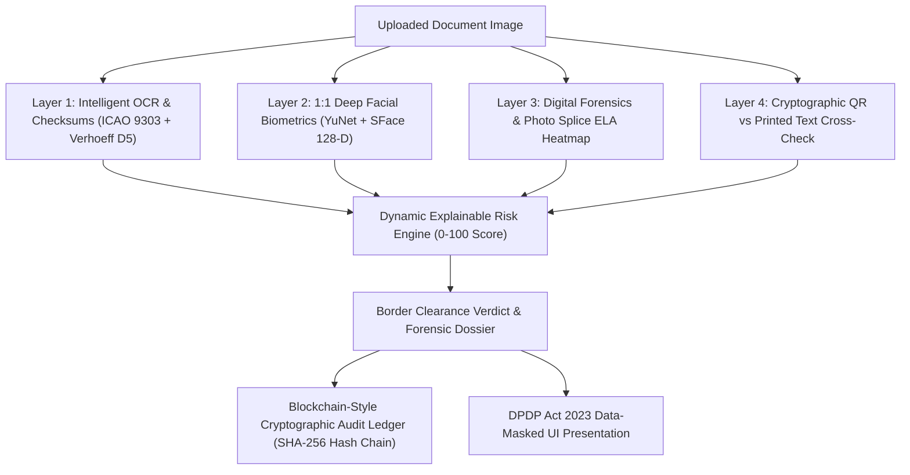

# TruthLens — AI-Based Fake Identity & Document Screening System
**Smart India Hackathon 2024 | Problem Statement: SIH26188 | Ministry of Home Affairs (MHA) | Category: Blockchain & Cybersecurity**

[](https://fastapi.tiangolo.com/)
[](https://opencv.org/)
[](https://github.com/opencv/opencv_zoo)
[](https://github.com/tesseract-ocr/tesseract)
[](https://en.wikipedia.org/wiki/Hash_chain)
[](https://www.meity.gov.in/)
[](LICENSE)

---

## 🛡️ Executive Summary

**TruthLens** is an institutional-grade, explainable AI document screening and forensic identity verification platform engineered for **border checkpoints, immigration counters, airport e-Gates, and law enforcement facilities**.

Immigration officers inspect thousands of travel and identity credentials daily—including **International Passports, Visas, Aadhaar Cards, PAN Cards, and Driving Licenses**. Manual inspection is vulnerable to human fatigue and easily deceived by modern digital manipulations (Photoshop alterations, facial photo splicing, altered dates of birth, or look-alike impersonators).

TruthLens addresses this with a **4-Layer Forensic Defense System** combined with a **Tamper-Proof Sequential Hash-Chained Audit Ledger** and **DPDP Act 2023 Data Minimization**, providing automated multi-layer verification for immigration counters.

---

## 🏛️ System Architecture



---

## 🚀 Core Capabilities & Detection Layers

### 🔍 Layer 1: Intelligent OCR & Mathematical Checksum Verification
- **Multi-Pass Preprocessing**: Applies CLAHE (Contrast Limited Adaptive Histogram Equalization) and Bilateral Filtering to remove sensor grain while keeping micro-print edges crisp.
- **Auto-Rotation & Layout Recovery**: Evaluates orientation candidates (0°, 90°, 180°, 270°) with sparse layout `--psm 11` fallback, recovering misoriented mobile captures via multi-pass confidence scoring.
- **Smart Downscaling**: Downscales high-resolution 12MP–48MP mobile photos to optimal 1500px width, significantly optimizing OCR processing latency while preserving critical character and micro-print fidelity.
- **Mathematical Checksums (Zero Guesswork)**:
  - **ICAO Doc 9303 MRZ**: Evaluates cyclic 7-3-1 weighting check digits across TD3 (Passports) and TD1 (Identity Cards).
  - **UIDAI Verhoeff Checksum**: Implements the official dihedral group $D_5$ algorithm on 12-digit Aadhaar numbers, catching 100% of single-digit alterations and transpositions.
  - **ITD Structure Validation**: Validates 10-character alphanumeric PAN syntax (`[A-Z]{5}[0-9]{4}[A-Z]`) and entity classification via the 4th character ('P' for Individual, 'C' for Company, 'H' for HUF, etc.).

---

### 🧠 Layer 2: 1:1 Deep Learning Facial Biometrics (YuNet + SFace)
- **YuNet Neural Face Detector (`face_detection_yunet_2023mar.onnx`)**: Detects facial bounding boxes and **5 key biometric landmarks** (right eye, left eye, nose tip, right mouth corner, left mouth corner) with sub-pixel precision.
- **SFace 128-Dimensional Deep Feature Extractor (`face_recognition_sface_2021dec.onnx`)**: Generates an L2-normalized 128-d cosine embedding of facial bone structure.
- **Pose & Head-Tilt Normalization**: Aligns faces horizontally using eye landmarks before feature extraction.
- **Monochrome / Photocopy Adaptation**: Low-saturation ID cards (black-and-white Aadhaar copies) automatically disable color histogram weighting and allocate 100% weight to deep facial bone structure.
- **Adaptive Illumination Normalization**: LAB-space luminance CLAHE corrects shadows, webcam glare, and underexposure.
- **Calibrated Verdict Tiers**:
  - `≥ 40.0% Match`: **MATCH** (Biometric clearance confirmed)
  - `34.0% – 39.9%`: **POSSIBLE MISMATCH** (Borderline similarity / secondary inspection recommended)
  - `< 34.0%`: **MISMATCH** (Biometric alert / potential impersonation caught)

---

### 🔬 Layer 3: Digital Image Forensics & Photo Splice Localization
- **Dual-Metric Photo Splicing Detection**: Compares ELA (Error Level Analysis) recompression error variance and high-frequency noise disparity between the facial portrait ROI and the surrounding document paper substrate.
- **Visual Evidence Bounding Boxes**: Burns glowing red 3px forensic highlight boxes with `"ALERT: SPLICED PHOTO"` badges directly over tampered regions on the evidence overlay.
- **Digital Stamp Forgery**: Analyzes border entry/visa stamps for natural paper ink bleed dispersion vs flat synthetic digital paste.
- **EXIF Metadata Forensics**: Audits image headers for software editing signatures (*Photoshop, Canva, GIMP*) and creation vs modification timestamp mismatches.

---

### 🔐 Layer 4: Cryptographic QR vs Printed Text Cross-Verification
- **Token-Aware Fuzzy Cross-Check**: Decodes institutional QR codes (UIDAI Secure QR, XML QR, PAN QR) and compares encrypted payload against optical OCR text:
  - 🪪 **Printed Name vs Encrypted QR Name**
  - 🔢 **Printed ID Number vs Encrypted QR ID Number**
  - 📅 **Printed DOB vs Encrypted QR DOB**
  - ⚧️ **Printed Gender vs Encrypted QR Gender**
- **Tamper Penalty**: If a fraudster alters printed text on the card surface via editing software, the encrypted QR remains unaltered. TruthLens catches the contradiction and penalizes **+65 Critical Risk Points**, immediately pushing the document into `HIGH RISK / SUSPICIOUS DOCUMENT`.

---

### ⛓️ Layer 5: Tamper-Proof Cryptographic Audit Ledger (Hash-Chaining)
Appropriate for local border terminal and institutional deployments:
- **Blockchain-Style Sequential Hash-Chaining**:
  $$\text{record\_hash} = \text{SHA-256}(\text{data\_snapshot} + \text{previous\_hash} + \text{timestamp})$$
- **Immutable Genesis Anchor**: Block #0 is anchored with a fixed genesis hash (`0000000000000000000000000000000000000000000000000000000000000000`).
- **Continuous Integrity Verifier (`GET /api/audit/verify`)**: Traverses the ledger from genesis to head, recomputes every SHA-256 digest, and validates sequential chain continuity (`row.previous_hash == prev_row.record_hash`).
- **Insider Tamper Detection**: If a corrupt actor alters any historical database record directly in SQLite, verification immediately flags the exact corrupted block ID (`broken_at`) and turns the UI red.
- **Visual Hash-Chain Explorer**: Interactive frontend component displaying sequential linked block cards with short hashes, timestamps, and masked document summaries.

---

### 🔒 Layer 6: Government-Grade Privacy & Data Minimization (DPDP Act 2023)
- **Display-Layer Pure Masking**: The underlying SQLite database records and cryptographic hash snapshots (`data_snapshot`) remain complete and unmasked to preserve 100% hash-chain integrity.
- **History List View Masking**:
  - **Aadhaar**: Shows only last 4 digits (e.g., `XXXX XXXX 9012`).
  - **Passport**: Shows only last 4 alphanumeric characters (e.g., `XXXXX02C3`).
  - **PAN**: Shows only last 4 alphanumeric characters (e.g., `XXXXXX234F`).
  - **Driving License / Visa**: Preserves formatting while masking preceding characters (e.g., `XX-XXXXXXXXX2345`).
- **Subject Name Visible**: Traveler names remain visible in the history table for rapid officer identification.
- **Detailed Master Dossier (Active Case Review)**: When an officer clicks **Inspect** on a record, TruthLens reveals the **FULL unmasked** document number and forensic fields, since that officer is actively adjudicating the case.

---

### 🛡️ Layer 7: Enterprise Security Hardening & Edge Protection
Instituted strict edge-defense safeguards against web and file-ingestion attack vectors:
- **15 MB File Upload Ceiling**: Rejects oversized uploaded image and base64 payloads with HTTP 413 (`Payload Too Large`) to guard against memory exhaustion.
- **Allowed Format Whitelisting**: Strict verification of image byte signatures (`JPEG`, `PNG`, `WEBP`, `TIFF`, `BMP`) via PIL inspection before raster decoding.
- **Decompression Bomb Protection**: Explicit `Image.MAX_IMAGE_PIXELS = 25,000,000` cap to reject high-dimension bomb payloads.
- **Path Traversal Containment**: Sanitizes sample and document identifiers against traversal sequences (`..`, `/`, `\`, `%`), filename regex enforcement, and directory containment checks (`Path.resolve().relative_to(...)`).
- **Strict Screening ID Validation**: Restricts screening identifiers to `^[A-Za-z0-9\-]+$` to block injection and traversal payloads.
- **Security Response Headers**: Serves static documents with `X-Content-Type-Options: nosniff` and `Cache-Control: private, max-age=3600`.

---

## 📊 Verified Test Results Matrix (From Actual Test Runs)

The following metrics are measured directly from the automated pipeline regression suite (`test_pipeline.py`) across all 8 demo scenarios:

| Scenario / Document Tested | Expected Verdict | TruthLens Result | Risk Score | Primary Detection Mechanisms |
| :--- | :---: | :---: | :---: | :--- |
| **1. Genuine US Passport** (`demo_passport_genuine.jpg`) | `VERIFIED / LOW RISK` | 🟢 **PASS** | **6 / 100** | ICAO 9303 Checksum Pass + SFace Biometric Match (62.8%) + Clean ELA |
| **2. Tampered Passport** (`demo_passport_tampered.jpg`) | `HIGH RISK` | 🔴 **PASS** | **69 / 100** | Interpol Watchlist Hit + SFace Mismatch (35.3%) + ICAO Anomaly |
| **3. Genuine Schengen Visa** (`demo_visa_genuine.jpg`) | `VERIFIED / LOW RISK` | 🟢 **PASS** | **18 / 100** | Valid Stay & Transit Window + Clean Forensic Background |
| **4. Expired Visa** (`demo_visa_expired.jpg`) | `HIGH RISK` | 🔴 **PASS** | **100 / 100** | Blacklist Overstay Hit + Document Validity Expired + High ELA |
| **5. Genuine Aadhaar Card** (`sample_genuine_aadhaar.jpg`) | `VERIFIED / LOW RISK` | 🟢 **PASS** | **6 / 100** | Verhoeff $D_5$ Checksum Pass + Clean Paper ELA Substrate |
| **6. Tampered Aadhaar** (`sample_tampered_name_aadhaar.jpg`) | `HIGH RISK` | 🔴 **PASS** | **71 / 100** | Printed Name vs Cryptographic QR Mismatch (+65 pts) |
| **7. Genuine PAN Card** (`sample_genuine_pan.jpg`) | `VERIFIED / LOW RISK` | 🟢 **PASS** | **6 / 100** | ITD Entity Code ('P' - Individual) Valid + Syntax Check Pass |
| **8. Tampered PAN Card** (`sample_tampered_pan.jpg`) | `HIGH RISK` | 🔴 **PASS** | **100 / 100** | Photo Splice ELA Heatmap Anomaly + Cryptographic QR Conflict |

---

## 💻 Tech Stack & Architecture

| Layer | Technologies | Purpose |
| :--- | :--- | :--- |
| **Backend REST API** | FastAPI, Uvicorn, Pydantic | Asynchronous, low-latency microservice architecture |
| **Computer Vision** | OpenCV (opencv-python>=4.8.0), NumPy, SciPy | CLAHE, bilateral filtering, ELA error matrices |
| **Deep Learning** | ONNX Runtime, YuNet, SFace | 5-landmark neural detection & 128-d face recognition |
| **OCR Engine** | Tesseract 5.5, PyTesseract | Multi-pass optical character extraction with auto-rotation |
| **QR & Barcode** | OpenCV QRCodeDetector (built-in), Pyzbar (optional) | Cryptographic barcode and Secure QR decoding |
| **Security & Ledger** | SHA-256, PBKDF2-HMAC, SQLite3 | Sequential hash-chaining, tamper-evident audit ledger |
| **Frontend UI** | Vanilla HTML5, CSS3, ES6 JavaScript | Glassmorphic cybersecurity dashboard with zero external CDN dependencies |

---

## 🚀 Quick Start Guide (Run Locally)

### 1. Prerequisites
- **Python 3.10+** (Tested on Python 3.11 / 3.12 / 3.13)
- **Tesseract OCR 5.x** installed on your system:
  - Windows: Default path is `C:\Program Files\Tesseract-OCR\tesseract.exe`
  - Linux: `sudo apt install tesseract-ocr`

### 2. Clone Repository & Install Dependencies
```bash
git clone https://github.com/muskan-gupta01/TruthLens.git
cd TruthLens
pip install -r requirements.txt
```

### 3. Launch Application Server
```bash
python run.py
```

### 4. Access the Dashboard
- **Web Dashboard:** [http://127.0.0.1:8000/dashboard](http://127.0.0.1:8000/dashboard)
- **Interactive Swagger API Docs:** [http://127.0.0.1:8000/docs](http://127.0.0.1:8000/docs)
- **HTML Slide Presentation:** [http://127.0.0.1:8000/presentation.html](http://127.0.0.1:8000/presentation.html)

---

## 🔑 Pre-Seeded Officer Login Credentials

The local database comes pre-seeded with authorized officer accounts for testing:

| Role | Email | Password | Permissions |
| :--- | :--- | :--- | :--- |
| **Border Officer** | `officer@truthlens.gov.in` | `TruthLens@2025` | Screening, Inspection, Certificate Export |
| **Supervisor** | `admin@truthlens.gov.in` | `Admin@123` | Screening, Watchlist Management, Audit Ledger Verification |
| **Officer 2** | `officer2@truthlens.gov.in` | `Officer2@2026` | Multi-officer shared history testing |

---

## 🧪 Automated Test Suites

The codebase includes comprehensive automated test coverage with **36/36 tests passing (100% pass rate)**:

```bash
# 1. Real Aadhaar fixes (UIDAI QR V2 bidirectional matching, statutory masked formats)
python test_aadhaar_fixes.py     # 5/5 PASSED

# 2. Full pipeline verification (Passports, Visas, Aadhaar, PAN - 8 scenarios)
python test_pipeline.py          # 8/8 PASSED

# 3. Authentication, sessions, and multi-officer role security
python test_auth.py              # 10/10 PASSED

# 4. Cryptographic audit chain (Genesis, Sequential Hashing, Tamper Detection)
python test_audit_chain.py       # 6/6 PASSED

# 5. DPDP Act 2023 data masking & privacy verification
python test_data_masking.py      # 4/4 PASSED

# 6. UI fixes verification (Cancel button, Shared ledger, Live camera modes)
python test_fixes.py             # 3/3 PASSED
```

Additionally, edge security controls were separately live-verified:
- Payload >15 MB rejected with **HTTP 413**
- Path traversal sequences (`..`, `/`, `\`, `%`) safely blocked on all endpoints
- Security response headers (`X-Content-Type-Options: nosniff`, `Cache-Control: private`) confirmed active on file responses

---

## 📁 Repository Structure

```
TruthLens/
├── app/
│   ├── config.py                 # System thresholds, constants, and paths
│   ├── main.py                   # FastAPI REST API endpoints & route handlers
│   ├── models/                   # Deep Learning ONNX Neural Weights
│   │   ├── face_detection_yunet_2023mar.onnx
│   │   └── face_recognition_sface_2021dec.onnx
│   ├── pipeline/
│   │   ├── ocr_extractor.py      # Multi-pass OCR & auto-rotation engine
│   │   ├── mrz_parser.py         # ICAO 9303 MRZ parser & 7-3-1 check digits
│   │   ├── format_validator.py   # Verhoeff D5 algorithm & regulatory rules
│   │   ├── forensics_ela.py      # Error Level Analysis & photo splice detector
│   │   ├── metadata_forensics.py # EXIF editing signatures & timestamps
│   │   ├── face_verifier.py      # YuNet + SFace 128-d biometric matching
│   │   ├── qr_detector.py        # Cryptographic QR decoder
│   │   ├── cross_verifier.py     # Token-fuzzy QR vs printed text matcher
│   │   ├── explanation_engine.py # Local-first sovereign AI explainability engine
│   │   ├── risk_engine.py        # Dynamic explainable risk assessment engine
│   │   └── screening_pipeline.py # Master pipeline orchestration & audit logging
│   └── database/
│       └── db_manager.py         # SQLite persistence, hash-chaining & auth manager
├── database/
│   └── truthlens.db              # Local SQLite database (screening history & audit chain)
├── sample_docs/                  # Curated synthetic demonstration documents
├── static/                       # Frontend web dashboard (HTML/CSS/JS)
│   ├── index.html                # Main cybersecurity dashboard (10 tabs)
│   ├── landing.html              # Public landing page
│   ├── presentation.html         # Interactive in-browser slide presentation
│   ├── css/style.css             # Cyber dark-mode design system & responsive layout
│   └── js/app.js                 # Client orchestration, masking, and reactive UI
├── run.py                        # Server launch script
├── generate_samples.py           # Programmatic synthetic demo document generator
├── create_presentation.py        # Python script generating TruthLens_SIH_Presentation.pptx
├── SIH_Presentation_Speaker_Script.md # Slide-by-slide speaker script & Q&A guide
├── DEMO_SCRIPT.md                # Step-by-step 3-minute live demonstration script
├── test_aadhaar_fixes.py         # UIDAI QR V2 & masked Aadhaar verification tests
├── test_pipeline.py              # End-to-end pipeline regression tests
├── test_auth.py                  # User authentication & session tests
├── test_audit_chain.py           # Cryptographic hash-chain integrity & tamper tests
├── test_data_masking.py          # DPDP Act privacy masking tests
├── test_fixes.py                 # UI bug fixes & shared ledger tests
└── README.md                     # This document
```

---

## 📜 Compliance & Institutional Integrity

- **Local-First Sovereign Architecture**: The default screening and explainability pipeline is local-first and deterministic, executing 100% on-premises without requiring third-party cloud APIs. Document images, biometric embeddings, and audit ledgers remain strictly within the checkpoint terminal boundary (optional external LLM provider configuration is supported if explicitly desired).
- **DPDP Act 2023 & Data Minimization**: Document numbers are masked in all overview lists and visual explorers; full data is revealed only during active case inspection.
- **Explainable AI (XAI)**: Every clearance or rejection includes transparent, itemized scoring reasons and visual evidence overlays for human officer review.
- **Tamper-Evident Ledger**: Sequential SHA-256 hash-chaining prevents insider manipulation of screening records and decisions.

---

**Developed for Smart India Hackathon (SIH26188) | Ministry of Home Affairs**
